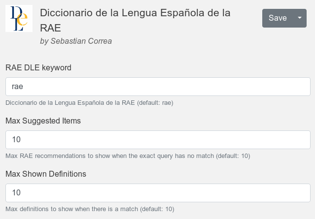

<!-- PROJECT SHIELDS -->
<!--
*** I'm using markdown "reference style" links for readability.
*** Reference links are enclosed in brackets [ ] instead of parentheses ( ).
*** See the bottom of this document for the declaration of the reference variables
*** for contributors-url, forks-url, etc. This is an optional, concise syntax you may use.
*** https://www.markdownguide.org/basic-syntax/#reference-style-links
-->
[![Stargazers][stars-shield]][stars-url]
[![Issues][issues-shield]][issues-url]
[![MIT License][license-shield]][license-url]
[![LinkedIn][linkedin-shield]][linkedin-url]


<!-- PROJECT LOGO -->
<br />
<p align="center">
  <a href="https://github.com/sebastian-correa/ulauncher-rae-dle">
    
  </a>

  <h3 align="center">Diccionario de la Lengua Española de la RAE</h3>

  <p align="center">
    Permite buscar palabras en el DLE de la RAE, así como copiar facilmente las definiciones al portapapeles.
    <br />
    <br />
    <a href="#sobre-el-proyecto">Demo</a>
    ·
    <a href="https://github.com/sebastian-correa/ulauncher-rae-dle/issues">Reportar un Bug</a>
    ·
    <a href="https://github.com/sebastian-correa/ulauncher-rae-dle/issues">Solicitar una Feature</a>
  </p>
</p>


<!-- TABLE OF CONTENTS -->
<details open="open">
  <summary><h2 style="display: inline-block">Contenidos</h2></summary>
  <ol>
    <li>
      <a href="#sobre-el-proyecto">Sobre el Proyecto</a>
    </li>
    <li>
      <a href="#empezar-a-usar">Empezar a Usar</a>
      <ul>
        <li><a href="#Requisitos">Requisitos</a></li>
        <li>
			<a href="#instalación">Instalación</a>
			<ul>
				<li><a href="#automática">Automática</a></li>
				<li><a href="#manual">Manual</a></li>
			</ul>
		</li>
      </ul>
    </li>
    <li>
		<a href="#uso">Uso</a>
		<ul>
			<li><a href="#opciones">Opciones</a></li>
		</ul>
	</li>
    <li><a href="#como-contribuir">Como contribuir</a></li>
    <li><a href="#licencia">Licencia</a></li>
    <li><a href="#contacto">Contacto</a></li>
  </ol>
</details>


<!-- Sobre el Proyecto -->
# Sobre el Proyecto

<p align="center">
  <a href="https://ext.ulauncher.io/-/github-sebastian-correa-ulauncher-rae-dle">
    
  </a>
</p>

Esta extensión para ulauncher permite buscar palabras en el DLE de la RAE de forma rápida.

Además, tiene una base de datos local con las definiciones de las 1000 palabras más comunes en Español, de forma de acelerar las búsquedas y para poder funcionar limitadamente sin internet.


<!-- Empezar a Usar -->
# Empezar a Usar

## Requisitos
Aparte de requerir ulauncher, RAE DLE requiere de los siguientes paquetes de python
*	BeautifulSoup4
*	Requests

## Instalación
Hay dos formas de instalar la extensión.
### Automática
1.	Abrir las preferencias de ulauncher.
2.	Ir a la sección de extensiones.
3.	Clickear en "Agregar extensión".
4.	Pegar el [link a este repo](https://github.com/sebastian-correa/ulauncher-rae-dle): `https://github.com/sebastian-correa/ulauncher-rae-dle`.

### Manual
1.	Cerrar ulauncher.
2.	En una consola,
	```
	cd ~/.local/share/ulauncher/extensions
	git clone https://github.com/sebastian-correa/ulauncher-rae-dle.git
	cd ulauncher-rae-dle
  	pip3 install -r requirements.txt
	```
3.	Abrir ulauncher.


<!-- Uso -->
# Uso
En ulauncher, introducir la _keyword_ (ver [Opciones](#opciones)) seguido de un espacio y la consulta que se quiera hacer a en el DLE. Consultas con más de una palabra son válidas (por ejemplo `rae dicc).

Existen cuatro resultados posibles:
1.  **Palabra Vacía:** Si no se introduce una palabra tras la _keyword_, la extensión dará un mensaje apropiado.
2.  **Resultado Exacto:** Si la búsqueda tiene un resultado exacto, se mostrará una lista con, a lo sumo, _Max Shown Definitions_ definiciones (ver [Opciones](#opciones)).
    1. <kbd>Enter</kbd>: Copia la definición elegida al portapapeles.
    2. <kbd>Alt</kbd> + <kbd>Enter</kbd>: Abre el DLE en el buscador y muestra la definición seleccionada.
3.  **Resultado Aproximado:** Si la búsuqueda no tiene un resultado exacto, el DLE puede sugerir búsquedas alternativas, que se mostrarán como una lista de opciones.
    1. <kbd>Enter</kbd>: Acepta la sugerencia seleccionada y realiza otra búsqueda mediante la extensión.
    2. <kbd>Alt</kbd> + <kbd>Enter</kbd>: Abre el DLE en el buscador y muestra la página de sugerencias.
4.  **Sin resultado:** En ocasiones, la búqueda ni existe en el DLE ni el DLE tiene sugerencias. En ese caso, se muestra un mensaje apropiado. 


## Opciones
La extensión cuenta con varias opciones, como se ve en la imagen a continuación.

<p align="center">
  
</p>


| **Opción**                 | **Descripción**                                                                                              | **Default** |
|----------------------------|--------------------------------------------------------------------------------------------------------------|-------------|
| **Keyword**                | El keyword a escribir en ulauncher para activar la extensión.                                                | `rae`       |
| **Max Suggested Items**    | Máxima cantidad de las sugerencias de la RAE que se muestran cuando la búsqueda no tiene resultados exactos. | `10`        |
| **Max Shown Definitions:** | Máxima cantidad de definiciones que se muestran de una palabra que está en el DLE.                           | `10`        |

<!-- Como contribuir -->
# Como contribuir

Cualquier contribución que mejore la extensión es **bienvenida**. Par contribuir:

1. Forkea el proyecto.
2. Crea una rama (branch) para desarrollar tu contribución (`git checkout -b feature/TuFeature`)
3. Hacé un commit con tus cambios (`git commit -m 'Add TuFeature'`)
4. Hacé un push a la branch (`git push origin feature/TuFeature`)
5. Abrí un Pull Request para integrar TuFeature a master.


<!-- Licencia -->
# Licencia
Distribuido bajo GPL-3.0. Ver `LICENSE` para más información.


<!-- Contacto -->
# Contacto

Sebastian Correa - [LinkedIn](https://www.linkedin.com/in/sebastian-correa-machado/)


<!-- MARKDOWN LINKS & IMAGES -->
<!-- https://www.markdownguide.org/basic-syntax/#reference-style-links -->
[stars-shield]: https://img.shields.io/github/stars/sebastian-correa/ulauncher-rae-dle.svg?style=flat
[stars-url]: https://github.com/sebastian-correa/ulauncher-rae-dle/stargazers
[issues-shield]: https://img.shields.io/github/issues/sebastian-correa/ulauncher-rae-dle.svg?style=flat
[issues-url]: https://github.com/sebastian-correa/ulauncher-rae-dle/issues
[license-shield]: https://img.shields.io/github/license/sebastian-correa/ulauncher-rae-dle.svg?style=flat
[license-url]: https://github.com/sebastian-correa/ulauncher-rae-dle/blob/master/LICENSE.txt
[linkedin-shield]: https://img.shields.io/badge/-LinkedIn-black.svg?style=flat&logo=linkedin&colorB=555
[linkedin-url]: https://www.linkedin.com/in/sebastian-correa-machado/
